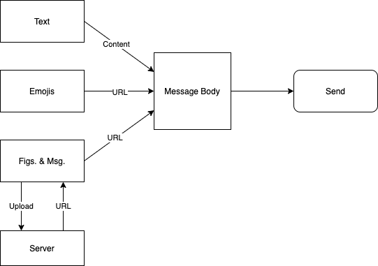
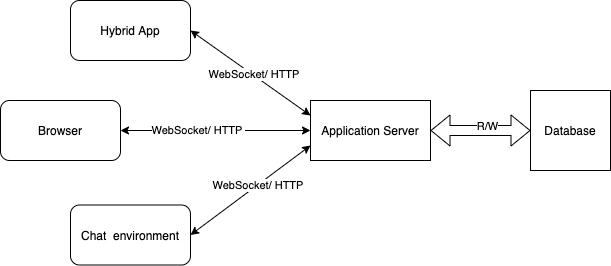

# IM-gossip-space
Online  instant messaging chat room written by Go and relevant techniques.

## System design

- **Resources**     
  - Messages contained text, emojis, figures and voice messages.


- **Database**          
  - Use WebSocket and HTTP to transfer data.
  - Application server read and write to database (MySQL).


## Installation & Run
```
# bash
```

## Test

## Deployment

## Contribution

## References

## Acknowledgement

## License
- [GNU General Public License v3.0](https://github.com/acse-sm321/IM-gossip-space/blob/main/LICENSE)